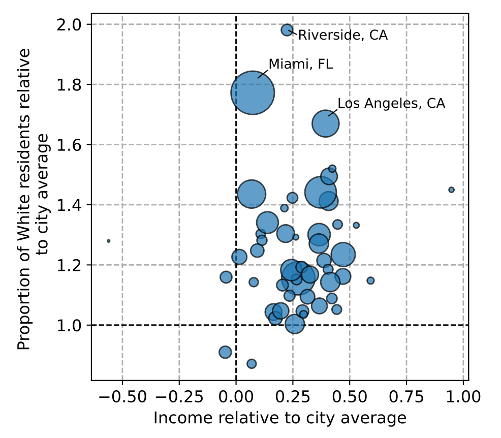

# Assessing the impacts of urban golf courses on access to greenspace in the United States

This repository contains the scripts to reproduce the data analysis.

### Figures

**Fig. 1** Schematic of data analysis framework for investigating the extent to which urban golf courses hinder accessibility to greenspace in the US.
  

**Fig. 2** Map showing area of urban greenspace per capita for the fifty largest cities in the US by population. The size of the circles represents the greenspace area per capita for all types of greenspace (including golf courses). The green wedges represent the area of publicly accessible greenspace while the yellow wedges represent the area of golf course per capita.
  

**Fig. 3** Map showing area of urban golf courses per capita for the fifty largest cities in the US by population. The size of the circles represents the golf course area per capita for all types of golf courses. The blue wedges represent the area of **public** golf courses per capita while the red wedges represent the area of **private** golf course per capita.
  

**Fig. 4** Map showing number of people who live within 1 km of a golf course, but further than 1 km from other types of greenspace for the fifty largest cities in the US by population. The size of the circles represents the number of people. The colored wedges represent different ethno-racial groups.
  

**Fig. 5** Characteristics of people who live within 1 km of a golf course, but further than 1 km from other types of greenspace for the fifty largest cities in the US by population. The size of the circles represents the number of people. Overall, people who live near golf courses but far from other types of greenspace tend to be wealthier and whiter than the city average. 
  